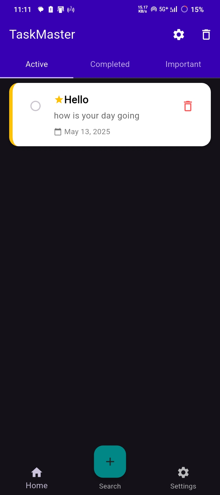
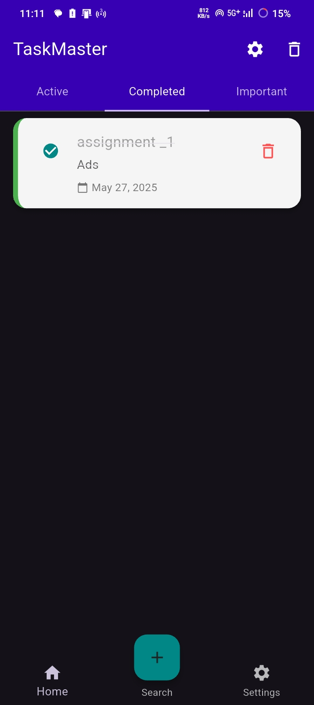
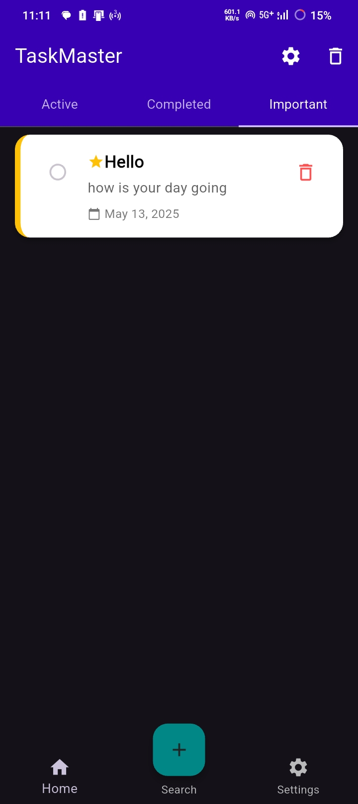
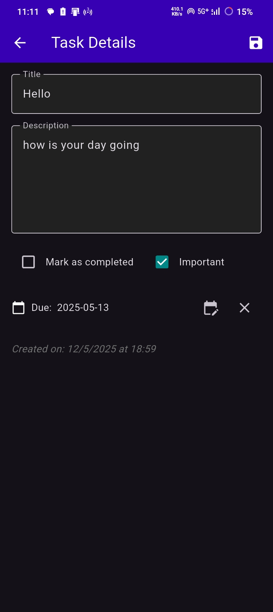
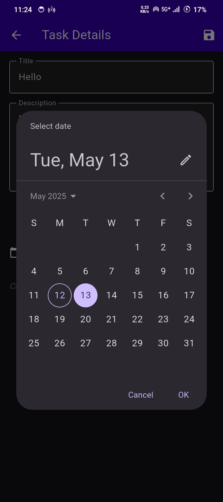

# TaskMaster - Advanced Todo List App
<a href = "https://drive.google.com/file/d/1kAj6BWMuDpFB4EK0qWAqOWoCjt9uEqxO/view?usp=drive_link">Download app from here!</a><br>
TaskMaster is a beautifully designed todo list application built with Flutter. It offers a clean interface and powerful features to help you stay organized.

## Features

- **Task Management:** Create, edit, delete, and mark tasks as complete
- **Persistence:** Tasks are saved locally and persist between app restarts
- **Important Tasks:** Flag tasks as important for quick access
- **Due Dates:** Add due dates to your tasks with reminders
- **Trash Bin:** Deleted tasks go to trash with option to restore
- **Categories:** Active, Completed, and Important task views
- **Beautiful UI:** Clean, modern interface with smooth animations

## Screenshots

<table>
    <tr>
        <td align="center">
            <br/>
            <b>Active Tasks</b>
        </td>
        <td align="center">
            <br/>
            <b>Completed Tasks</b>
        </td>
        <td align="center">
            <br/>
            <b>Important Tasks</b>
        </td>
    </tr>
    <tr>
        <td align="center">
            <br/>
            <b>Task Details</b>
        </td>
        <td align="center">
            <br/>
            <b>Trash Bin</b>
        </td>
        <td align="center">
            <br/>
            <b>Task Expiry</b>
        </td>
    </tr>
</table>

## Installation

### Android

1. Download the APK from the releases section
2. Enable installation from unknown sources in your device settings
3. Open the APK file to install

### From Source Code

1. Clone this repository
```bash
git clone https://https://github.com/Harshad-Gore/To-Do-Flutter-App.git
```

2. Install dependencies
```bash
cd TaskMaster
flutter pub get
```

3. Run the app
```bash
flutter run
```

## Building for Production

### Android

```bash
flutter build apk --release
```
The APK file will be available at `build/app/outputs/flutter-apk/app-release.apk`

### iOS

```bash
flutter build ios --release
```
Then follow the standard iOS deployment process using Xcode.

## Usage Guide

### Adding a Task
- Tap the + button at the bottom of the screen
- Enter a title and optional description
- Set importance and due date if desired
- Tap "ADD TASK"

### Editing a Task
- Tap on any task to open the detail view
- Edit any field as needed
- Tap "SAVE CHANGES" when done

### Completing a Task
- Tap the checkbox next to a task
- Or swipe right to reveal the complete action

### Deleting a Task
- Swipe left to reveal the delete action
- Tasks are moved to trash rather than permanently deleted

### Managing Trash
- Tap the trash icon in the app bar to view deleted tasks
- Use the restore button to recover deleted tasks
- Empty trash to permanently remove all deleted tasks

## Technologies Used

- Flutter
- Dart
- SharedPreferences for local storage
- Material Design 3

## License

This project is licensed under the MIT License - see the LICENSE file for details.

## Acknowledgements

- Flutter team for the amazing framework
- Material Design for the beautiful UI components
- All contributors who helped improve this app
